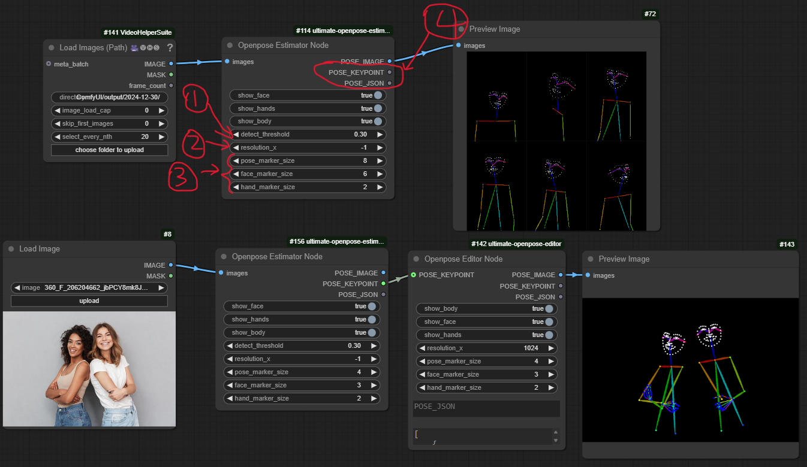
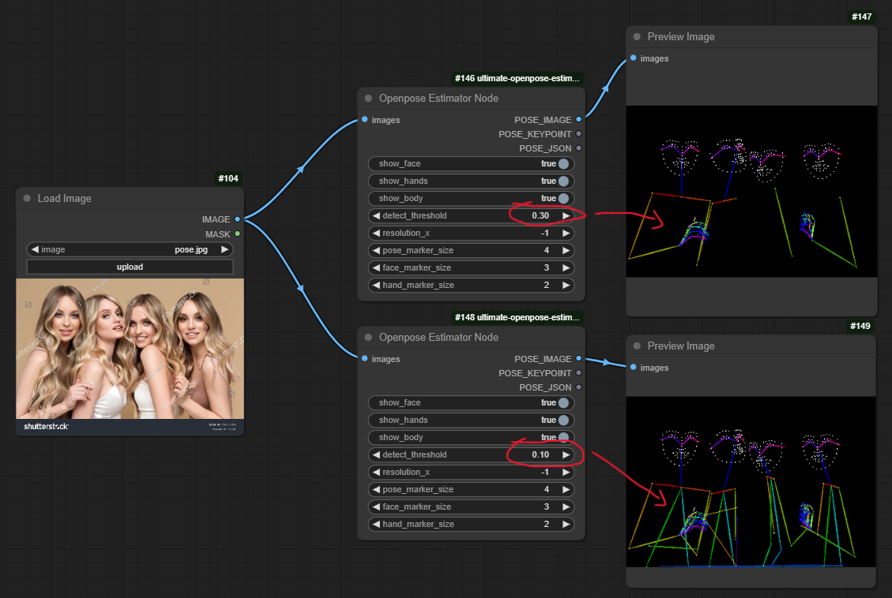

<div align="center">

# ComfyUI ultimate openpose(dwpose) estimator 

[](https://www.python.org/downloads/release/python-31012/)
[](https://developer.nvidia.com/cuda-downloads)
[](https://developer.nvidia.com/tensorrt)
[](https://creativecommons.org/licenses/by-nc-sa/4.0/deed.en)

</div>

<p align="center">
  
</p>

This is an enhancement of the project [ComfyUI Dwpose TensorRT](https://github.com/yuvraj108c/ComfyUI-Dwpose-Tensorrt) by giving control and output options. Check original project for the super fast performance.

**Note: This is for tensorrt only, which is only working if you have cuda based Nvidia card**

This project following the original project's license which is [CC BY-NC-SA](https://creativecommons.org/licenses/by-nc-sa/4.0/), everyone is FREE to access, use, modify and redistribute with the same license.

If you use this project for commercial purposes, please contact at yuvraj108c@gmail.com (the original project) and cc to me tttom.jjjack@gmail.com

If you like the project, please give me a star! ⭐

---

## Features

- Giving the detecting threshold option
    <p align="center">
      
    </p>
- Giving output canvas resolution adjustment 
    - It will keep original picture's ratio
    - Minimum requirement for resolution\_x >= 64px, for value < 64, the output pose image will be 512px
- Giving the plot control options for body pose, face and hands 
    - The default marker size value is optimized for 1024px pictures, for smaller size picture, lower the marker size value, otherwise increase the marker size value
- Giving output options of pose keypoints and json string formats for further using, check my [ultimate-openpose-editor](https://github.com/westNeighbor/ComfyUI-ultimate-openpose-editor) if you need editting the pose 

## Installation

- Navigate to the ComfyUI `/custom_nodes` directory

```bash
git clone https://github.com/westNeighbor/ComfyUI-ultimate-openpose-estimator
cd ./ComfyUI-ultimate-openpose-estimator
pip install -r requirements.txt # if you use portable version, see below
```
if you use portable version, install requirement accordingly, for example, I have portable in my E: disk
```bash
E:/ComfyUI_windows_portable/python_embeded/python.exe -m pip install -r requirements.txt
```
- Restart ComfyUI

## Building Tensorrt Engine

1. Download the following onnx models:
   - [dw-ll_ucoco_384.onnx](https://huggingface.co/yzd-v/DWPose/resolve/main/dw-ll_ucoco_384.onnx)
   - [yolox_l.onnx](https://huggingface.co/yzd-v/DWPose/resolve/main/yolox_l.onnx)
2. Build tensorrt engines for both of these models by running:

   - `python export_trt.py`

3. Place the exported engines inside ComfyUI `/models/tensorrt/dwpose` directory

## Usage

- Insert node by `Right Click -> ultimate-openpose -> Opnepose Estimator Node`

## Credits

- https://github.com/yuvraj108c/ComfyUI-Dwpose-Tensorrt
- https://github.com/IDEA-Research/DWPose
- https://github.com/legraphista/dwpose-video

## License

[Creative Commons Attribution-NonCommercial-ShareAlike 4.0 International (CC BY-NC-SA 4.0)](https://creativecommons.org/licenses/by-nc-sa/4.0/)
